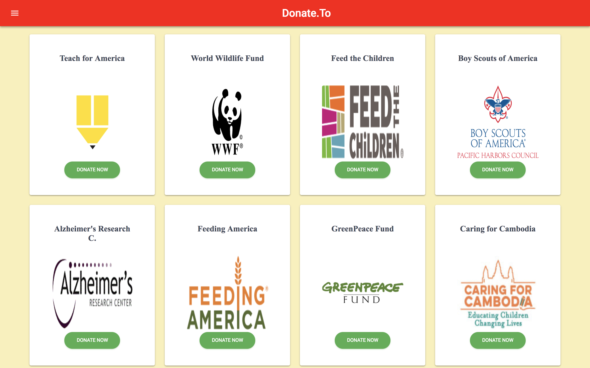
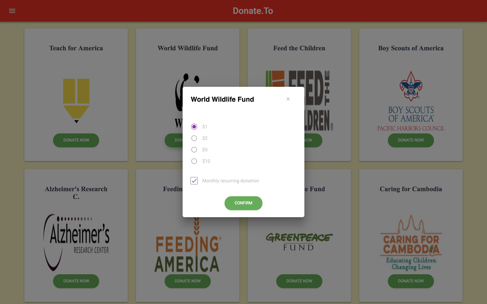

Donate.To is an app started at AngelHack 2018 to make it easier for donors to provide continued support to their favorite charities (Patreon for charities).

## How to use Donate.To:

Upon opening the app, scroll down to view charities. Click on the "Donate Now" button of your favorite charity.

Select the amount you wish to donate. Choose whether the amount will be a monthly recurring donation. Confirm your choices by clicking the "Confirm" button.

View your subscriptions by clicking the menu icon on the top left. Click on a charity and adjust your donation preferences.

## Technologies used:
* [React](https://reactjs.org/)
* [Material-UI](https://material-ui.com/)
* [Material Kit React](https://demos.creative-tim.com/material-kit-react/#/)

## Credits:
* Alona Varshal
* Andrew Roy Chen
* Jacob Salazar
* Jessica Sung